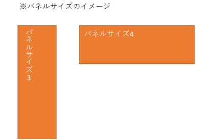

## テーブル情報
* 論理テーブル名：ユーザーマスタ
* 物理テーブル名：m_user
* 更新日　　　：2021/7/17

## カラム情報
| No. | 論理名           | 物理名      | データ型 | サイズ | 主キー | NULL許容 | デフォルト値 | 備考                                       |
| --- | ---------------- | ----------- | -------- | ------ | ------ | -------- | ------------ | ------------------------------------------ |
| 1   | ユーザーID       | user_id     | VARCHAR  | 20     | ○      | ×        | なし         | ユーザーログイン時に使用する。             |
| 2   | ユーザー名       | user_name   | VARCHAR  | 40     | ×      | ×        | なし         | ユーザー登録時はユーザーIDと同じ値にする。 |
| 3   | パスワード       | password_hash    | CHAR  | 60     | ×      | ×        | なし         | -                                          |
| 4   | 登録日時         | insert_time | DATETIME | -      | ×      | ○        | なし         | -                                          |
| 5   | 更新日時         | update_time | DATETIME | -      | ×      | ○        | なし         | ユーザー登録時は登録日時と同じ値にする。   |
| 6   | ユーザーアイコン | user_icon   | TEXT     | -      | ×      | ○        | なし         | ユーザーアイコンのパス。                   |

***
## テーブル情報
* 論理テーブル名：ユーザーパネル情報
* 物理テーブル名：t_user_panel_info
* 更新日　　　：2021/10/16

## カラム情報
| No. | 論理名       | 物理名     | データ型 | サイズ      | 主キー | NULL許容 | デフォルト値 | 備考                                                                                    |
| --- | ------------ | ---------- | -------- | ----------- | ------ | -------- | ------------ | --------------------------------------------------------------------------------------- |
| 1   | ユーザーID   | user_id    | VARCHAR  | 20          | ○      | ×        | なし         | -                                                                                       |
| 2   | パネル名     | panel_name | VARCHAR  | 100         | ×      | ○        | なし         | パネルが、どのコンテンツであるかを表す。パネルクラスで定義するパネル名を使用する。      |
| 3   | アンカー番号 | anchor_num | SMALLINT | 0～16777215 | ○      | ×        | なし         | 符号なし。パネルの位置を表す。                                                          |
| 4   | パネルサイズ | panel_size | TINYINT  | 0～255      | ×      | ○        | なし         | 符号なし。5：小(1/16サイズ)、4：中(1/8サイズ(※))、3：中(1/8サイズ(※))、2：大(1/4サイズ) |

***
## テーブル情報
* 論理テーブル名：パネルマスタ
* 物理テーブル名：m_panel
* 更新日　　　：2021/9/13

## カラム情報
| No. | 論理名           | 物理名        | データ型 | サイズ | 主キー | NULL許容 | デフォルト値 | 備考                        |
| --- | ---------------- | ------------- | -------- | ------ | ------ | -------- | ------------ | --------------------------- |
| 1   | パネル名         | panel_name    | VARCHAR  | 100    | ○      | ×        | なし         | -                           |
| 2   | コンテンツリンク | content_link  | TEXT     | -      | ×      | ×        | なし         | HTML、PHPファイルへのパス。 |
| 3   | コンテンツ画像   | content_image | TEXT     | -      | ×      | ×        | なし         | 画像のパス。                |
