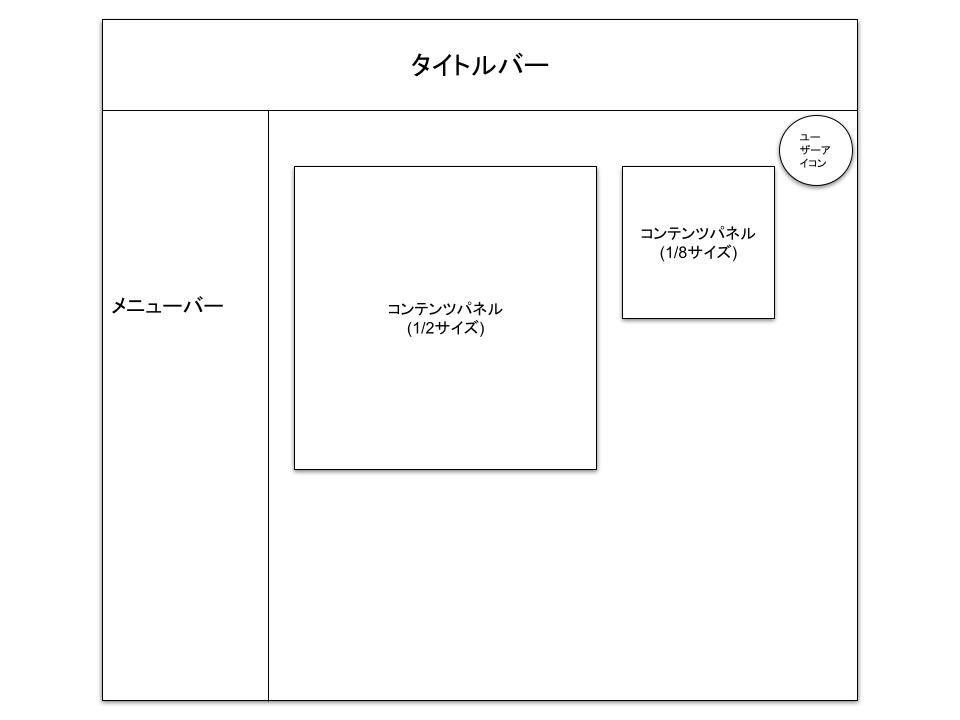

## 画面名
- メイン画面
---
## UI

---
## 機能概要
- 各コンテンツへのアクセス
- カスタマイズしたパネル情報に基づいたパネル配置
---
## 機能詳細
- **タイトルバー**
    - サイト名を表示する
- **メニューバー**
    - クリックすることで、クリックしたコンテンツへ遷移する
- **コンテンツパネル**
    - クリックすることで、クリックしたコンテンツへ遷移する
    - パネルサイズは、1/2サイズ、1/4サイズ、1/8サイズの3種類
    - パネルの位置及びサイズは、ユーザーごとにカスタマイズ可能
    - パネルには各コンテンツの情報が表示されている(内容は各コンテンツに一任する)
- **ユーザーアイコン**
    - クリックすることで、ログイン画面に遷移する
    - ログイン後は、ユーザーが設定した画像を表示することが可能
---
## 必要なデータ
- ユーザーID 
取得元：Cookie(セッションIDで管理)
- パネル情報 
取得元：DB(ユーザーパネル情報テーブル)
- ユーザーアイコンパス 
取得元：DB(ユーザーマスタテーブル)
---
## ユーザー操作
- メニューバーのクリック
- コンテンツパネルのクリック
- ユーザーアイコンのクリック
