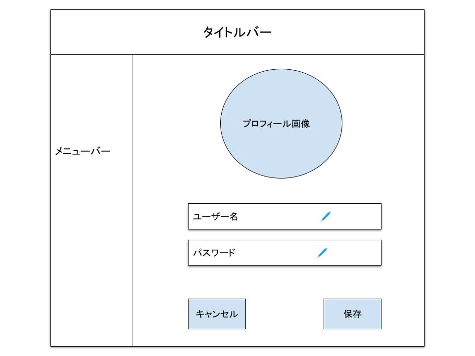

## 画面名
- プロフィール画面
---
## UI

---
## 機能概要
- プロフィール画像の変更
- ユーザー名の変更
- パスワードの変更
---
## 機能詳細
- **プロフィール画像**
    - 現在登録されているプロフィール画像を表示する
    - クリックすることで、画像を選択するダイアログボックスが表示される
- **ユーザー名**
    - 現在登録されているユーザー名を表示する
    - 鉛筆マークをクリックすると、ユーザー名を変更できるようになる
- **パスワード**
    - 現在登録されているパスワードを「*」に置換して表示する
    - 鉛筆マークをクリックすると、表示がすべてクリアされて、パスワードを変更できるようになる
- **キャンセル**
    - デフォルトは無効のボタン
    - プロフィール画像・ユーザー名・パスワードのいずれかが変更されたら、有効になる
    - クリックすることで、編集内容を破棄してよいか確認するダイアログボックスが表示される
- **保存**
    - デフォルトは無効のボタン
    - プロフィール画像・ユーザー名・パスワードのいずれかが変更されたら、有効になる
    - クリックすることで、編集内容を確定してよいか確認するダイアログボックスが表示される
---
## 必要なデータ
- ユーザーID  
取得元：Cookie(セッションIDで管理)
- ユーザーアイコンパス  
取得元：DB(ユーザーマスタテーブル)
- ユーザー名  
取得元：DB(ユーザーマスタテーブル)
- パスワード  
取得元：DB(ユーザーマスタテーブル)
---
## ユーザー操作
- プロフィール画像の変更
- ユーザー名の変更
- パスワードの変更
- キャンセルボタンのクリック
- 保存ボタンのクリック
