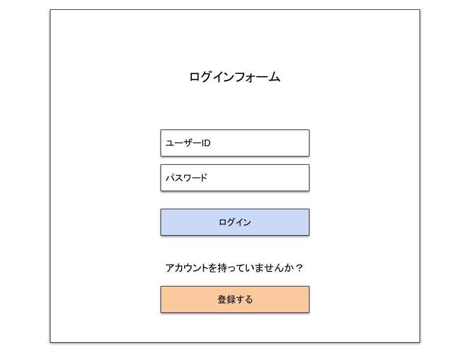
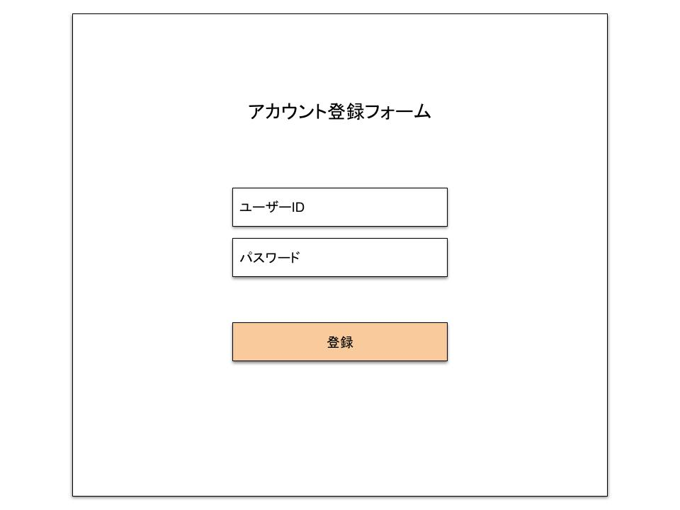

## 画面名
- サインインアップ画面
---
## UI
- サインイン画面

- サインアップ画面

---
## 機能概要
- 入力されたユーザーIDとパスワードを照合してログインする
- 入力されたユーザーIDとパスワードからユーザーアカウントを作成する
---
## 機能詳細
- **ユーザーID**
    - ユーザーIDを入力するテキストボックス
    - 2バイト文字が含まれていれば入力チェックNGとする
    - 文字数が21文字以上であれば入力チェックNGとする
    - 文字数が5文字以下であれば入力チェックNGとする
    - 入力された文字に半角英字、半角数字、"-"以外が含まれていれば入力チェックNGとする
- **パスワード**
    - パスワードを入力するテキストボックス
    - 2バイト文字が含まれていれば入力チェックNGとする
    - 文字数が21文字以上であれば入力チェックNGとする
    - 文字数が5文字以下であれば入力チェックNGとする
    - 入力された文字に半角英字、半角数字、"-"以外が含まれていれば入力チェックNGとする
- **ログインボタン**
    - クリックすることで、入力されたユーザーIDとパスワードを、DBに照合して、アカウントが存在すればログインする
- **登録するボタン**
    - クリックすることで、サインアップ画面に遷移する
- **登録ボタン**
    - クリックすることで、入力されたユーザーIDとパスワードを、DBに照合して、アカウントが存在しなければ、アカウントを新規作成する
---
## 必要なデータ
- ユーザーID 
取得元：ユーザーが画面に入力
- パスワード 
取得元：ユーザーが画面に入力
- 登録済みのユーザーアカウント 
取得元：DB(ユーザーマスタテーブル)
---
## ユーザー操作
- ユーザーIDを入力
- パスワードを入力
- ログインボタンをクリック
- 登録するボタンをクリック
- 登録ボタンをクリック
